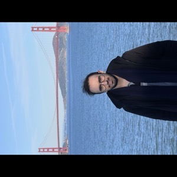

# Amirhossein Afsharrad

I am a PhD candidate in [Electrical Engineering](https://ee.stanford.edu/) at [Stanford University](https://www.stanford.edu/), where I work on problems at the intersection of **optimization**, **control**, and **machine learning**.

My research interests include:
- Optimization and control theory
- Reinforcement learning and bandits
- Machine learning theory and applications

I am fortunate to collaborate with the [Stanford Lall Group](https://lall.stanford.edu/), [Stanford Tse Lab](https://tselab.stanford.edu/), as well as industry partners including Wells Fargo and Toyota Research Institute.

Prior to Stanford, I received my B.Sc. in Electrical Engineering and Computer Science from [Sharif University of Technology](http://www.sharif.ir/home), where I was fortunate to work with [Prof. Mohammadali Maddah-Ali](https://scholar.google.com/citations?user=CFIJZwoAAAAJ&hl=en).

## News

- **January 2025**: New preprint on generalizable spacecraft trajectory generation via multimodal learning with transformers
- **January 2025**: Paper on cooperative multi-agent constrained stochastic linear bandits submitted

## Contact

- **Email**: [afsharrad@stanford.edu](mailto:afsharrad@stanford.edu)
- **Google Scholar**: [Profile](https://scholar.google.com/citations?user=yuvhn2oAAAAJ&hl=en)
- **GitHub**: [amirafsharrad](https://github.com/amirafsharrad)

---

*Last updated: February 2025*
