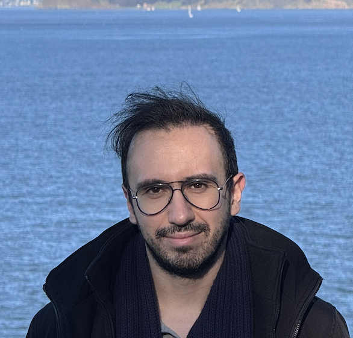

  

  
  

    <h1 style="margin-top: 0;">Amirhossein Afsharrad</h1>
    
<strong>PhD Candidate, Electrical Engineering</strong> 
    Stanford University

    

      <strong>Email:</strong> afsharrad@stanford.edu 
      <svg style="width: 16px; height: 16px; vertical-align: middle; margin-right: 5px;" viewBox="0 0 24 24"><path fill="currentColor" d="M12,3L1,9L12,15L21,10.09V17H23V9M5,13.18V17.18L12,21L19,17.18V13.18L12,17L5,13.18Z"/></svg>
      <a href="https://scholar.google.com/citations?user=yuvhn2oAAAAJ" target="_blank">Google Scholar</a> 
      <svg style="width: 16px; height: 16px; vertical-align: middle; margin-right: 5px;" viewBox="0 0 24 24"><path fill="#0077B5" d="M19 3A2 2 0 0 1 21 5V19A2 2 0 0 1 19 21H5A2 2 0 0 1 3 19V5A2 2 0 0 1 5 3H19M18.5 18.5V13.2A3.26 3.26 0 0 0 15.24 9.94C14.39 9.94 13.4 10.46 12.92 11.24V10.13H10.13V18.5H12.92V13.57C12.92 12.8 13.54 12.17 14.31 12.17A1.4 1.4 0 0 1 15.71 13.57V18.5H18.5M6.88 8.56A1.68 1.68 0 0 0 8.56 6.88C8.56 5.95 7.81 5.19 6.88 5.19A1.69 1.69 0 0 0 5.19 6.88C5.19 7.81 5.95 8.56 6.88 8.56M8.27 18.5V10.13H5.5V18.5H8.27Z"/></svg>
      <a href="https://www.linkedin.com/in/afsharrad/" target="_blank">LinkedIn</a>
    

  

## About

I am a PhD candidate in [Electrical Engineering](https://ee.stanford.edu/) at [Stanford University](https://www.stanford.edu/), advised by [Professor Sanjay Lall](https://lall.stanford.edu/).

My current research primarily focuses on **post-training of large language models**, **LLM alignment with human preferences**, and **evaluation and reward modeling of LLMs**.

I am also interested in more theoretical problems in **optimization and reinforcement learning**, including bandit problems with safety constraints and multi-agent settings, as well as problems at the intersection of **optimization and control** such as applications of transformer models in control theory and autonomous systems. These areas were a primary focus earlier in my PhD, and I continue to work on projects in these directions.

Prior to Stanford, I received my B.Sc. in Electrical Engineering and Computer Science from [Sharif University of Technology](http://www.sharif.ir/home), where I was advised by [Prof. Mohammadali Maddah-Ali](https://maddah.umn.edu/).

## News

- **January 2026**: Our paper "Beyond Binary Preferences: A Principled Framework for Reward Modeling with Ordinal Feedback" was accepted to ICLR 2026 [[paper](https://openreview.net/forum?id=mteZOi0xyu)]
- **December 2024**: Presented "LORE: Lagrangian-Optimized Robust Embeddings for Visual Encoders" at NeurIPS 2024 in San Diego
